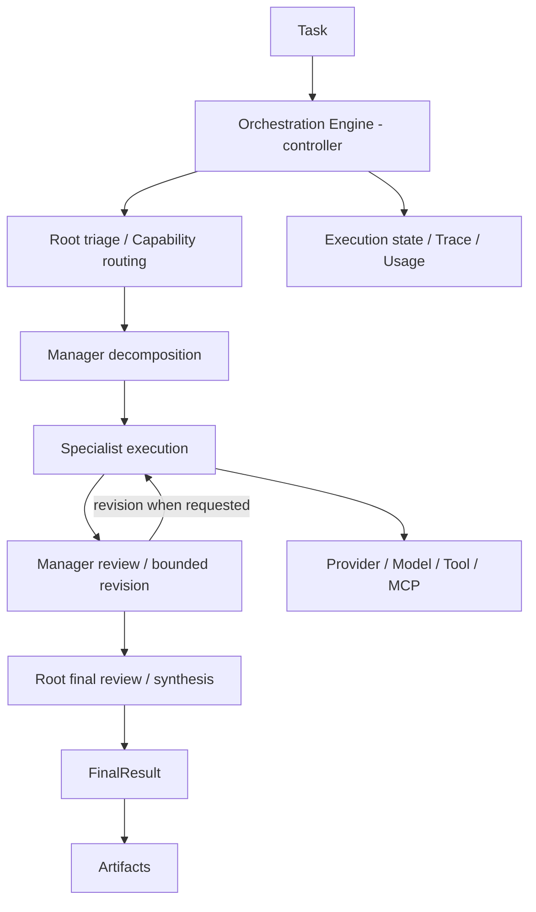

# AgentTree

AgentTree คือ hierarchical Multi-Agent orchestration framework สำหรับ Python จัดงานผ่าน **Root → Manager → Specialist** ด้วย Capability-based routing, Provider/Model bindings และ Tool/MCP runtime โดยไม่ผูกกับ domain เช่น security, network หรือ software development

**Version: 0.2.2 alpha** · Python **3.10+** · research framework / โครงการปริญญานิพนธ์

ต้องการ Web Application สำหรับออกแบบและทดสอบ Tree: ดู [AgentTree Studio](https://github.com/FlukeNoppanan/agenttree-studio) ซึ่งเป็น repository แยกต่างหาก

## แนวคิดหลักและบทบาทของ Agent

- **Root** วิเคราะห์ Task ประสานงานระดับ Tree และตรวจ/สังเคราะห์ผลลัพธ์สุดท้าย
- **Manager** รับงานที่ตรงกับ Capability แบ่งเป็น Subtask มอบหมายให้ Specialist ตรวจผล และขอ revision ภายในขอบเขตที่กำหนด
- **Specialist** ทำงานเฉพาะด้านโดยใช้ Provider/Model และ Tools ที่ได้รับ

**Orchestration Engine เป็น runtime/controller ไม่ใช่ AI Agent** Agent เป็น configuration/identity; การเลือก Provider, Tool และ execution policy ประกอบขึ้นผ่าน framework

## Architecture



แผนภาพแสดงลำดับหลัก ไม่ได้แปลว่าทุก Tree ต้องใช้ AI Model ในทุก strategy; framework มี deterministic strategies สำหรับทดสอบและการประกอบ workflow ด้วย

## Capability-Based Routing

Capability ระบุว่า Agent เหมาะกับงานประเภทใด การค้นหาและเลือก Manager/Specialist ใช้ Capability ที่ configuration กำหนด แทนการ hardcode ชื่อ domain หรือประเภท application ใน framework การ review และ revision เป็นส่วนหนึ่งของ orchestration และมีขอบเขต ไม่ใช่การวนซ้ำโดยไม่จำกัด

## Provider / Model

รองรับ **OpenAI, Gemini, Ollama, Groq, OpenRouter, Cerebras และ OpenAI-compatible endpoints** ผ่าน adapter boundary เดียวกัน รวมถึง `MockProvider` สำหรับ offline tests สามารถ bind Provider/Model แยกตาม Agent ได้

แต่ละ Model มีความสามารถและข้อจำกัดต่างกัน โดยเฉพาะ structured decisions, Tool calling และ streaming การตั้งค่าหรือพบ Model ไม่ใช่หลักฐานว่าทุก feature ใช้งานได้ ต้องตรวจ validation/qualification ใน application ที่นำ Core ไปใช้ Credentials อยู่ใน configuration ของ Provider ไม่ควรใส่ใน Task metadata หรือ Trace

## Tool และ MCP

Tool Registry จัดการ definitions/bindings ส่วน Tool Executor และ Tool Sessions จัดการ invocation ตาม policy ที่กำหนด มี MCP **stdio** และ **Streamable HTTP** สำหรับ external Tools และ data sources รวมถึง Artifact Output สำหรับผลลัพธ์ที่เป็นไฟล์

Tools เป็นทรัพยากรที่ Agent ใช้ ไม่ใช่ Agent อีกบทบาทหนึ่ง การอนุญาตให้ใช้ Tool, ขอบเขต filesystem และ Secret management ต้องกำหนดใน host application ไม่ได้ถือว่าทุก Tool ปลอดภัยโดยอัตโนมัติ

## Execution Runtime

- synchronous `AgentTree.run(Task(...))` คืน `FinalResult`
- background `ExecutionRuntime` มี execution state, events, cancellation และ results
- streaming ใช้ output deltas จาก Provider ที่รองรับจริง ไม่จำลองการพิมพ์ข้อความ
- Trace และ usage accounting ช่วยตรวจขั้นตอนการมอบหมายงาน การ review/revision และการเรียก Tools
- execution-store abstractions มี in-memory และ SQLite-backed persistence/checkpoints; recovery ขึ้นกับ runtime/store configuration ที่ใช้
- controlled Manager collaboration ใช้กติกาและขอบเขตที่กำหนด ไม่ใช่ A2A หรือ distributed execution

Core recovery contract ไม่ได้เท่ากับ recovery ของ deployment ทุกแบบ เช่น Studio มีข้อจำกัด active Run เมื่อ backend process restart

## การติดตั้งจาก source

```bash
git clone https://github.com/FlukeNoppanan/Agenttree.git
cd Agenttree
git switch --detach thesis-baseline-v0.1
python3 -m venv .venv
. .venv/bin/activate
python -m pip install -e '.[dev]'
```

หากต้องใช้ real Provider SDKs หรือ MCP ให้ติดตั้ง extras ที่เกี่ยวข้อง:

```bash
python -m pip install -e '.[providers,mcp]'
```

มี extras `openai`, `gemini`, `ollama` และ `langgraph` ด้วย ดูรายการจริงใน [pyproject.toml](pyproject.toml) ตัวอย่างนี้ติดตั้งจาก repository ไม่ได้อ้างว่ามี release บน PyPI

## ตัวอย่างใช้งานแบบ offline

ตัวอย่างนี้ใช้ public API ปัจจุบันและ `MockProvider` จึงไม่ต้องมี API Key และไม่เรียกบริการที่มีค่าใช้จ่าย:

```python
from agenttree import AgentTree, ManagerAgent, RootAgent, SpecialistAgent, Task
from agenttree.core import (
    RuleBasedTaskTriage, StaticFinalReviewer, StaticManagerReviewer,
    StaticTaskDecomposer,
)
from agenttree.models import SubtaskTemplate
from agenttree.providers import MockProvider

framework = AgentTree(
    root_agent=RootAgent(name="Root"),
    triage=RuleBasedTaskTriage({}, fallback_capabilities=("analysis",)),
    decomposer=StaticTaskDecomposer((
        SubtaskTemplate("Summarize the supplied information", ("summarize",)),
    )),
    manager_reviewer=StaticManagerReviewer(),
    final_reviewer=StaticFinalReviewer(),
)
manager = ManagerAgent(name="Coordinator", capabilities=("analysis",))
specialist = SpecialistAgent(name="Summarizer", capabilities=("summarize",))
provider = MockProvider(response_content="A concise offline summary.")
framework.register_manager(manager)
framework.register_specialist(manager, specialist)
framework.register_provider(provider)
framework.bind_provider(specialist, provider)
result = framework.run(Task(objective="Summarize the supplied information"))
print(result.status.value, result.success)
print(result.content)
print(result.trace.event_count)
```

ตัวอย่างฉบับเต็มอยู่ที่ [examples/basic_hierarchy.py](examples/basic_hierarchy.py) หลังติดตั้งแล้วเรียกได้ด้วย:

```bash
python examples/basic_hierarchy.py
python -m pytest -q
```

## Thesis Baseline

Frozen runtime baseline คือ annotated tag **`thesis-baseline-v0.1`** ที่ commit **`f01856b99a079c01e00c60988d3657819c95a188`** ดู tag ใน [GitHub repository](https://github.com/FlukeNoppanan/Agenttree/tree/thesis-baseline-v0.1)

ผลตรวจ runtime ที่ freeze: **729 tests passed, 5 existing skips** ตัวเลขนี้เป็นผลตรวจ historical baseline ไม่ใช่การรับรอง runtime ใหม่จากการแก้ README

Core branch HEAD อาจใหม่กว่า tag เพราะมี Thai README documentation commit แต่ runtime source ยังคงตรงกับ frozen baseline ไม่สร้าง Core `thesis-baseline-v0.1.1` สำหรับการเปลี่ยนเอกสาร

## สถานะและข้อจำกัด

เป็น alpha research framework ไม่ใช่ enterprise production-ready system ความถูกต้องของ output ยังขึ้นกับ Provider/Model, policies, Tools และการตรวจสอบของ application ที่นำไปใช้

ยังไม่ได้ implement **Learning, A2A, distributed execution, Human Approval หรือ chatbot/conversation memory** เป็นระบบพร้อมใช้งาน กรณีศึกษา Wazuh → AgentTree → Discord, Network Configuration และ Software Development อยู่ในแผนของโครงการ ยังไม่ได้เริ่มจาก README revision นี้ และไม่ใช่ domain logic ใน Core

## License

Repository ยังไม่มี LICENSE file ที่ประกาศ license เฉพาะ จึงไม่ระบุ license ที่เจ้าของโครงการยังไม่ได้เลือก
