# AgentTree

AgentTree คือเฟรมเวิร์ก Python 3.10+ สำหรับประสานงานระบบหลายเอเจนต์แบบลำดับชั้นและทำงานแบบซิงโครนัส แอปพลิเคชันเจ้าบ้านเป็นผู้กำหนดเอเจนต์ ความสามารถ กลยุทธ์การตัดสินใจ ผู้ให้บริการโมเดล และเครื่องมือเสริม ส่วน AgentTree ทำหน้าที่ประสานลำดับงานดังนี้:

```text
Root -> Manager -> Specialist -> การตรวจทานโดย Manager -> การตรวจทานขั้นสุดท้ายโดย Root
```

เวอร์ชัน **0.2.1** เป็นรุ่นอัลฟาก่อนเผยแพร่ที่แก้ไขข้อบกพร่อง สำหรับประเมินเฟรมเวิร์กและทดลองเชื่อมต่อในระยะแรก

## คุณสมบัติเด่น

- SDK ระดับสูง `AgentTree.run(Task)` พร้อม API ระดับล่างที่ยังใช้งานได้
- ค้นหา Manager และ Specialist ตามความสามารถ พร้อมระบุความเป็นเจ้าของอย่างชัดเจน
- การประมวลผลที่ไม่ผูกกับผู้ให้บริการ พร้อมอะแดปเตอร์ Mock, OpenAI, Gemini และ Ollama
- วงจรตรวจทานและแก้ไขโดย Manager และขั้นสุดท้ายที่มีขีดจำกัด
- เครื่องมือฟังก์ชันและการเชื่อมต่อเครื่องมือ/ข้อมูลผ่าน MCP ด้วย binding ภายนอก
- สถานะลำดับงานในหน่วยความจำและ trace การทำงานที่เรียงตามลำดับ
- การประสานงานแบบลำดับเป็นค่าเริ่มต้น และมีแบ็กเอนด์ LangGraph เป็นตัวเลือก
- ตัวอย่างออฟไลน์ที่ให้ผลแน่นอนและชุดข้อมูลประเมินผลหลายโดเมน

## การติดตั้ง

ติดตั้งแกนหลักที่ไม่มี dependency จากซอร์สโค้ดที่ checkout ไว้:

```sh
python -m pip install -e .
```

dependency สำหรับการพัฒนาและการเชื่อมต่อเสริมแยกเป็น extras:

```sh
python -m pip install -e ".[dev]"
python -m pip install -e ".[providers]"   # SDK ของ OpenAI + Gemini + Ollama
python -m pip install -e ".[langgraph]"
python -m pip install -e ".[mcp]"
```

extras รายผู้ให้บริการคือ `openai`, `gemini` และ `ollama` การติดตั้ง extra จะไม่เรียก API และ AgentTree จะไม่โหลดไฟล์ `.env`

## เริ่มต้นอย่างรวดเร็ว

ตัวอย่างฉบับสมบูรณ์นี้ทำงานแบบออฟไลน์และระบุ dependency สำหรับการตัดสินใจทั้งหมดอย่างชัดเจน:

```python
from agenttree import AgentTree, ManagerAgent, RootAgent, SpecialistAgent, Task
from agenttree.core import (
    RuleBasedTaskTriage,
    StaticFinalReviewer,
    StaticManagerReviewer,
    StaticTaskDecomposer,
)
from agenttree.models import SubtaskTemplate
from agenttree.providers import MockProvider

framework = AgentTree(
    root_agent=RootAgent(name="Root"),
    triage=RuleBasedTaskTriage(
        {}, fallback_capabilities=("analysis",),
    ),
    decomposer=StaticTaskDecomposer((
        SubtaskTemplate("Summarize the input", ("summarize",)),
    )),
    manager_reviewer=StaticManagerReviewer(),
    final_reviewer=StaticFinalReviewer(),
)

manager = ManagerAgent(name="Coordinator", capabilities=("analysis",))
specialist = SpecialistAgent(name="Summarizer", capabilities=("summarize",))
provider = MockProvider(response_content="A deterministic offline summary.")

framework.register_manager(manager)
framework.register_specialist(manager, specialist)
framework.register_provider(provider)
framework.bind_provider(specialist, provider)

result = framework.run(Task(objective="Summarize the input"))
print(result.status.value, result.success)
print(result.content)
print(result.trace.event_count)
```

`Task` คืออินพุตมาตรฐาน และค่าที่ส่งคืนคือ `FinalResult` SDK จะคัดลอกอินพุต Task เก็บ provider binding แยกจากตัวตนของเอเจนต์ และเปิดเผยสถานะล่าสุดแบบป้องกันการแก้ไขผ่าน `framework.last_state` ดูรายละเอียดการลงทะเบียนและความล้มเหลวได้ที่ [การเริ่มต้นใช้งาน](docs/getting-started.md)

## สถาปัตยกรรม

```mermaid
flowchart LR
    App[แอปพลิเคชันของนักพัฒนา] --> SDK[AgentTree SDK]
    SDK --> Triage[งานและการคัดแยก]
    Triage --> Backend[แบ็กเอนด์การประสานงาน]
    Backend --> Manager[Manager]
    Manager --> Specialist[Specialist]
    Specialist --> MReview[การตรวจทานโดย Manager]
    MReview --> FReview[การตรวจทานขั้นสุดท้ายโดย Root]
    FReview --> Result[FinalResult]
```



SDK ประกอบ registry, กลยุทธ์, executor, สถานะ, trace และบริการประสานงานที่มีอยู่เข้าด้วยกัน เอเจนต์ไม่สื่อสารกันเองแบบ peer-to-peer อย่างอิสระ แต่เฟรมเวิร์กจะประสานงานผ่านลำดับชั้น Root/Manager/Specialist นโยบายเฉพาะโดเมนยังคงอยู่ในแอปพลิเคชันของนักพัฒนา ดู [สถาปัตยกรรม](docs/architecture.md)

## เอเจนต์และความสามารถ

`RootAgent`, `ManagerAgent` และ `SpecialistAgent` ใช้อธิบายตัวตนและความสามารถที่คงที่ Manager เป็นเจ้าของ Specialist ของตน ส่วน `CapabilityRegistry` ใช้ค้นหาแบบ normalized เมธอดลงทะเบียนระดับสูงจะรักษาความสัมพันธ์เหล่านี้ให้สอดคล้องกัน และปฏิเสธข้อมูลซ้ำก่อนเกิดการเปลี่ยนแปลงเพียงบางส่วน ดู [เอเจนต์และความสามารถ](docs/agents-and-capabilities.md)

การคัดแยกที่ขับเคลื่อนด้วย provider จะได้รับความสามารถของ Manager ที่ลงทะเบียนอยู่ในขณะนั้น ส่วนการแยกงานที่ขับเคลื่อนด้วย provider จะได้รับเฉพาะความสามารถของ Specialist ที่ลงทะเบียนและอยู่ภายใต้ Manager ที่เลือก หากคำตอบใช้ป้ายความสามารถที่ไม่รู้จัก ระบบจะยก `DecisionOutputError` ก่อนการค้นหา เพื่อป้องกันไม่ให้ผลลัพธ์จากโมเดลสร้างชื่อความสามารถที่ไม่สามารถกำหนดเส้นทางได้โดยไม่แจ้งเตือน

## ผู้ให้บริการโมเดล

`BaseProvider.generate(ProviderRequest)` ส่งคืน `ProviderResponse` ที่ผ่านการทำ normalization แล้ว `MockProvider` ให้ผลแน่นอนและทำงานออฟไลน์ ส่วน `OpenAIProvider`, `GeminiProvider` และ `OllamaProvider` ที่เป็นตัวเลือกจะแปลง contract เดียวกันไปยัง SDK ของแต่ละราย แอปพลิเคชันเลือกโมเดลและข้อมูลรับรองผ่านการกำหนดค่า SDK หรือ environment โดย AgentTree ไม่มีโมเดลเริ่มต้นและไม่มี fallback อัตโนมัติ ดู [ผู้ให้บริการโมเดล](docs/providers.md)

## เครื่องมือและ MCP

`FunctionTool` และ `MCPTool` ใช้ `ToolRegistry`, `ToolBindingRegistry` และการเรียกผ่าน `ToolExecutor` อย่างชัดเจนร่วมกัน `MockMCPClient` รองรับการทดสอบออฟไลน์ ส่วน `StdioMCPClient` และ `StreamableHttpMCPClient` เป็น transport จริงที่เลือกใช้ได้ และ `MCPToolLoader` ใช้ค้นหาและปรับเครื่องมือจากเซิร์ฟเวอร์

MCP ใช้เชื่อมต่อเครื่องมือและข้อมูล ไม่ใช่การสื่อสารระหว่างเอเจนต์ และ `run()` จะไม่วางแผนหรือเรียกเครื่องมือโดยอัตโนมัติ ดู [เครื่องมือและ MCP](docs/tools-and-mcp.md)

## แบ็กเอนด์การประสานงาน

`SequentialOrchestrationBackend` เป็นค่าเริ่มต้นที่ไม่ต้องใช้แพ็กเกจเสริม `LangGraphOrchestrationBackend` จะจับคู่เฟสเดียวกันเข้ากับกราฟแบบซิงโครนัสเมื่อติดตั้ง extra `langgraph` ทั้งสองแบบคงกฎการตรวจทาน ขีดจำกัดการแก้ไข contract ของสถานะ และป้าย trace ของ engine ไว้เหมือนกัน ดู [การประสานงาน](docs/orchestration.md)

## สถานะและ trace การทำงาน

`framework.last_state` ส่งคืน snapshot ของ `WorkflowState` ล่าสุดในหน่วยความจำ `FinalResult.trace` เก็บเหตุการณ์ตามลำดับสำหรับการคัดแยก การวางแผน การมอบหมาย การทำงานของ Specialist การตรวจทานโดย Manager การตรวจทานขั้นสุดท้าย เครื่องมือเมื่อถูกเรียกอย่างชัดเจนด้วย trace นั้น และการสร้างผลลัพธ์ สถานะจะไม่ถูกบันทึกถาวร และอินสแตนซ์เฟรมเวิร์กหนึ่งตัวไม่รองรับการรันพร้อมกัน

## ตัวอย่างหลายโดเมน

ตัวอย่างทั้งหมดที่เก็บไว้ทำงานแบบออฟไลน์:

```sh
python examples/thesis_demo.py
python examples/thesis_demo.py --revision
python examples/basic_hierarchy.py
python examples/provider_hierarchy.py
python examples/langgraph_hierarchy.py       # ต้องติดตั้ง .[langgraph]
python examples/domains/it_technical.py
python examples/domains/hr_document.py
python examples/domains/business_product.py
```

เดโมวิทยานิพนธ์แสดงการกำหนดเส้นทาง Manager/Specialist ที่ให้ผลแน่นอน provider binding ที่แยกจากกัน การตรวจทาน ผลลัพธ์สุดท้าย และสรุป trace แปดขั้นตอน โหมด `--revision` แสดง Manager ตัดสินใจ REVISE ก่อนตามด้วย PASS คำสั่งเสริมสำหรับการนำเสนอและแนวทางสำรองเมื่อเกิดความล้มเหลวอยู่ใน [เดโมวิทยานิพนธ์](docs/thesis-demo.md)

โปรแกรมตัวอย่างแต่ละโดเมนกำหนดลำดับชั้นสำหรับ IT/เทคนิค, HR/เอกสาร และธุรกิจ/ผลิตภัณฑ์ไว้นอก `src/agenttree/` ทั้งหมดใช้ SDK เดียวกันและข้อมูลสังเคราะห์ โดยกรณี IT จะเรียก `FunctionTool` เพิ่มด้วย

## การประเมินผล

รันสถานการณ์ที่ให้ผลแน่นอนหกรายการและสร้าง JSON ที่พร้อมใช้ในรายงาน:

```sh
python evaluation/run_evaluation.py
```

ตัวรันวัดเงื่อนไขด้านการนำกลับมาใช้ซ้ำ การต่อยอด การกำหนดเส้นทาง ความเป็นอิสระจาก provider ความสามารถในการติดตาม และการเชื่อมต่อเครื่องมืออย่างชัดเจน จากนั้นเขียนผลไปยัง `evaluation/results.json` และจะทดสอบความเทียบเท่ากับ LangGraph หากติดตั้งไว้ ดู [การประเมินผล](docs/evaluation.md) และ [รายละเอียดวิธีการ](evaluation/README.md) แผนที่ข้อเท็จจริงระหว่างการพัฒนากับหลักฐานอยู่ใน [ขอบเขตที่ครอบคลุม](docs/scope-coverage.md)

## ข้อผิดพลาดและความล้มเหลวของลำดับงาน

การกำหนดค่าที่ไม่ถูกต้อง dependency/binding ที่ขาดหาย การตัดสินใจจาก provider ที่มีรูปแบบผิด และความล้มเหลวของแบ็กเอนด์หรือ transport จะยก exception แบบมีชนิด ส่วนผลลัพธ์ของลำดับงานที่คาดหมาย เช่น ไม่พบ Manager ที่ตรง ไม่มีงานสำหรับ Specialist การตรวจทานเป็น FAIL หรือใช้จำนวนการแก้ไขครบแล้ว จะส่งคืน `FinalResult` แบบมีโครงสร้างและไม่สำเร็จเมื่อ contract ของลำดับงานรองรับกรณีนั้น ดู [ข้อผิดพลาด](docs/errors.md)

## ข้อจำกัดปัจจุบัน

AgentTree ทำงานแบบซิงโครนัสและเก็บข้อมูลในหน่วยความจำ ไม่มีโปรโตคอล A2A, การส่งข้อความระหว่างเอเจนต์แบบ peer-to-peer, persistence/ฐานข้อมูล, การประมวลผลแบบกระจาย, การวางแผนใช้เครื่องมืออัตโนมัติ, provider fallback/การกำหนดเส้นทางตามต้นทุน, Web API หรือ GUI อะแดปเตอร์เสริมยังเป็นการเชื่อมต่อระยะแรกและต้องอาศัยการกำหนดค่าจากแอปพลิเคชัน การประเมินผลแสดงพฤติกรรมซอฟต์แวร์ภายใต้ชุดข้อมูลที่ให้ผลแน่นอน ไม่ได้ยืนยันความฉลาดของโมเดล ความถูกต้องในทุกโดเมน ความสามารถในการปรับขนาด หรือความน่าเชื่อถือระดับ production

โครงการยังไม่ได้เลือกหรือประกาศสัญญาอนุญาตโอเพนซอร์ส ดังนั้น repository นี้ยังไม่ได้ให้สิทธิ์ใช้งาน แก้ไข หรือแจกจ่าย ควรเลือกและเพิ่มสัญญาอนุญาตก่อนเผยแพร่สู่สาธารณะ

## การพัฒนาและการทดสอบ

```sh
python -m venv .venv
python -m pip install -e ".[dev]"
python -m pytest -q
python -m compileall -q src tests examples evaluation
python -m build
```

การทดสอบให้ผลแน่นอนและไม่เรียก provider จริง การทดสอบการเชื่อมต่อ MCP ใช้ fixture แบบ stdio ภายในเครื่องหรือ loopback ผลลัพธ์ `build/`, `dist/`, egg-info, cache, virtual environment, ข้อมูลรับรอง และผล coverage ที่สร้างขึ้นจะถูก ignore ดู [CONTRIBUTING.md](CONTRIBUTING.md) และ [CHANGELOG.md](CHANGELOG.md)
