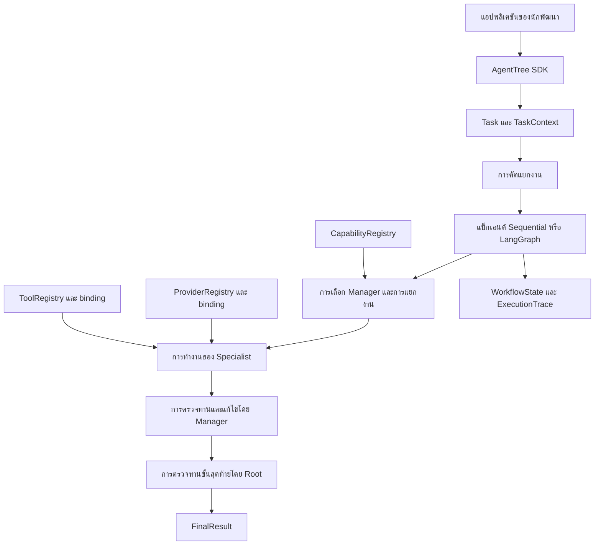

# สถาปัตยกรรม

AgentTree แยกการกำหนดค่าของนักพัฒนาออกจากการประสานลำดับงาน:

## ความรับผิดชอบของแต่ละชั้น

- **Models** คือ dataclass และ enum ที่ไม่ขึ้นกับโดเมน สำหรับงาน ผลลัพธ์ แผน สถานะ และ trace
- **Agents** กำหนดตัวตนและความสามารถแบบ immutable โดย Manager เป็นเจ้าของสมาชิก Specialist และเอเจนต์จะไม่ส่งข้อความถึงกันเองอย่างอิสระ
- **Registries** ให้บริการค้นหาแบบ normalized ตามลำดับ โดยไม่ประมวลผลงาน
- **กลยุทธ์และบริการใน Core** ทำหน้าที่คัดแยก แยกงาน ประมวลผลผ่าน provider ตรวจทาน และจัดการสถานะ
- **OrchestrationEngine** ควบคุมการเลือกตามความสามารถ พฤติกรรมแต่ละเฟส ขีดจำกัดการแก้ไข การรวมผลลัพธ์ และเหตุการณ์ trace โดยส่งความสามารถของ Manager ที่ลงทะเบียนให้การคัดแยกที่ขับเคลื่อนด้วย provider และส่งความสามารถของ Specialist ที่ลงทะเบียนและอยู่ภายใต้ Manager ที่เลือกให้การแยกงานที่ขับเคลื่อนด้วย provider
- **Backends** ประสานการดำเนินการในแต่ละเฟสที่มีอยู่ แบ็กเอนด์ sequential เป็นค่าเริ่มต้น ส่วน LangGraph เป็นอะแดปเตอร์แบบซิงโครนัสที่เลือกใช้ได้
- **AgentTree** ประกอบส่วนประกอบระดับล่างเหล่านี้เข้าด้วยกันสำหรับการใช้งานทั่วไป

ทิศทาง dependency เริ่มจาก SDK facade ไปยังส่วนประกอบระดับล่าง แพ็กเกจระดับล่างจะไม่ import facade การพัฒนา provider ไม่ควบคุมการกำหนดเส้นทาง และเครื่องมือไม่ตัดสินใจด้านการประสานงาน ชื่อเอเจนต์ ความสามารถ prompt และนโยบายเฉพาะโดเมนจะอยู่ในแอปพลิเคชันเจ้าบ้าน

กลยุทธ์ตัดสินใจของ provider อาจตีความวัตถุประสงค์ แต่ผลลัพธ์การกำหนดเส้นทางจะถูกจำกัดขณะทำงาน การคัดแยกเลือกได้เฉพาะค่าความสามารถแบบ normalized ที่ Manager ที่ลงทะเบียนประกาศไว้ การแยกงานเลือกได้เฉพาะค่าที่ Specialist ซึ่งทั้งลงทะเบียนและอยู่ภายใต้ Manager ปัจจุบันประกาศไว้ ค่าที่ไม่รู้จักจะทำให้ยก `DecisionOutputError` ก่อนค้นหาเอเจนต์

สถานะและ trace อยู่ในหน่วยความจำและป้องกันการแก้ไขผ่านขอบเขต API สาธารณะ ระบบไม่มีฐานข้อมูล checkpointer ตัวจัดตารางงานแบบกระจาย โปรโตคอล A2A หรือช่องทางสื่อสารระหว่างเอเจนต์แบบ peer-to-peer
