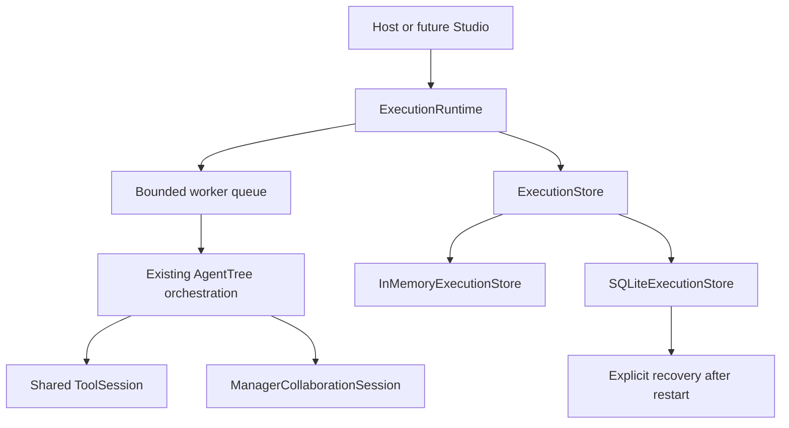

# Durable execution runtime

`AgentTree.run(task)` remains the synchronous API. `AgentTree.start(task, runtime=...)` or `ExecutionRuntime.submit(tree, task)` submits the same Tree orchestration to bounded background workers. A runtime controls scheduling, status, cancellation, and checkpoints; it does not implement another Root/Manager/Specialist engine. The built-in sequential and LangGraph backends call `OrchestrationContext.run_phase()` and support these checkpoints; a custom backend must use that phase wrapper to participate in recovery.



## Host API

```python
from agenttree.core import ExecutionRuntime, SQLiteExecutionStore

runtime = ExecutionRuntime(SQLiteExecutionStore("agenttree-runs.db"),
                           max_workers=2, max_pending=8)
handle = runtime.submit(tree, task, timeout=300)
execution_id = handle.execution_id
status = handle.status()        # nonblocking ExecutionInfo, without raw input or result JSON
result = handle.result(timeout=30)
runtime.shutdown(wait=True)
```

`handle.cancel()` requests cancellation. `handle.result()` returns a completed `FinalResult`, raises `ExecutionFailed` for a failed run, `ExecutionCancelled` for a cancelled run, and `TimeoutError` if its wait expires. `runtime.handle(execution_id)` retrieves a previously completed record from a reopened store without executing the Tree. `runtime.store.list_recoverable()` lists nonterminal records; `runtime.recover(execution_id, reconstructed_tree)` explicitly continues one. Importing the library never starts recovery. `AgentTree.start(task)` creates an in-memory runtime lazily; supply a SQLite-backed runtime for restart durability. `shutdown(wait=False)` returns without waiting for daemon workers; queued/running durable records remain inspectable and require explicit recovery after process exit.

## State, identity, and ownership

The Task ID is the execution ID in record, checkpoint, trace, cancellation, and result. Legal transitions are `QUEUED → RUNNING|CANCELLED`, `RUNNING → COMPLETED|FAILED|CANCELLATION_REQUESTED`, and `CANCELLATION_REQUESTED → CANCELLED`. Terminal states cannot restart. Each transition and checkpoint uses compare-and-swap versioning. SQLite uses `BEGIN IMMEDIATE` transactions, a versioned `executions` row, and one latest `checkpoints` row per execution. A stale writer fails with `ExecutionConflict`. Background capacity is `max_workers + max_pending`; excess submissions raise `ExecutionCapacityError` before a record is created.

A running record has a local process ID and runtime owner ID. A second live local runtime cannot recover it. After the original process exits, explicit recovery takes ownership through a versioned update. This is local-process protection, not a distributed lease or multi-host consensus protocol. Reconstruct the same agent IDs, hierarchy, provider/model names and bindings, Tool IDs and assignments, collaboration permissions, and config. A safe SHA-256 Tree fingerprint checks those structural inputs before recovery; it contains no provider clients or credentials. The host re-registers providers and Tools through normal configuration. A missing provider/Tool binding or changed structure blocks recovery. A fingerprint does not prove equivalence of arbitrary Python Tool implementations or provider behavior. Submission keys are not yet supported; hosts should use stable Task IDs to reject accidental duplicate submissions.

## Checkpoints and replay policy

`ExecutionCheckpoint` schema version **1** stores explicit allowlisted JSON, never pickle. It contains a safe `WorkflowState`, accumulated provider usage, Tool counts/metrics/events, Manager messages/threads/budgets/metrics/events, and runtime lifecycle events. Checkpoints are committed after a complete planning, delegation, Specialist execution, Manager review, or final review phase. The completed phase is skipped on recovery. A checkpoint after delegation preserves completed Manager Tool calls and collaboration responses; a checkpoint after execution preserves all completed Specialist outputs; a checkpoint after Manager review preserves revision outcomes and budgets. Recovery can resume Root final synthesis without rerunning completed Managers or Specialists. Final result and trace remain durable in the execution record, with `execution.completed` last after successful synthesis.

Before an unfinished phase begins, the runtime persists an `in_flight` marker. Phase 6 adds a durable [operation journal](operation-journal.md) below this boundary. Recovery reruns the unfinished phase through journal-aware calls, reuses committed results, retries uncertain provider work with a new recorded physical attempt, and blocks uncertain Tools unless their explicit policy permits recovery. Existing Tools default to `UNKNOWN`. This does not guarantee exactly-once external side effects. `ExecutionRecoveryBlocked` exposes a machine-readable `code` and, where relevant, an `operation_key`.

Checkpoint input/result/trace payloads have a two-megabyte default encoded limit. Serialization permits only known contract classes, enums, UTC timestamps, tuples, maps, and JSON primitives. Unsupported live objects and unknown schema versions are rejected. Common credential fields and patterns are redacted. Provider clients, credentials, Tool callables, MCP clients, sockets, locks, and threads are never written. The SQLite file still contains task input and potentially sensitive work products; hosts should apply normal filesystem access controls and avoid putting secrets in arbitrary unlabelled text.

## Cancellation and deadlines

Cancellation before start commits `CANCELLED` without calling providers or Tools. While running, cancellation commits `CANCELLATION_REQUESTED`, signals the execution control, and the watchdog commits `CANCELLED`. If completion commits first, it wins; if cancellation commits first, late output cannot commit a `FinalResult`. Execution-level `timeout` is a UTC deadline with the same cancellation terminal state. Phase boundaries, provider/Tool loops, and Manager collaboration check the signal; Tool and collaboration waits also respect the remaining deadline.

Python cannot kill a synchronous provider, Tool, or MCP call already executing. The watchdog makes status and `result()` settle promptly, and checks prevent late results from advancing orchestration when those calls return. A blocked worker remains occupied until its synchronous call returns. Phase 3's daemon Tool thread may still finish physically after timeout, and legacy host-controlled `ToolExecutor` raw error behavior is unchanged; durable failures store only an error type. This runtime does not provide distributed workers, streaming, artifacts, database-backed Manager messaging, or exactly-once external side effects.

## Future Studio contract

Studio can map `POST /api/v2/runs` to `submit`, `GET /api/v2/runs/{id}` to `get_execution`, `POST /api/v2/runs/{id}/cancel` to `cancel`, `GET /api/v2/runs/{id}/result` to `result`, and `GET /api/v2/runs/{id}/events?after=<sequence>` to `handle.events(after=...)`. A future PostgreSQL implementation can satisfy `ExecutionStore` without changing orchestration. Event streaming and Studio UI integration are separate work.
