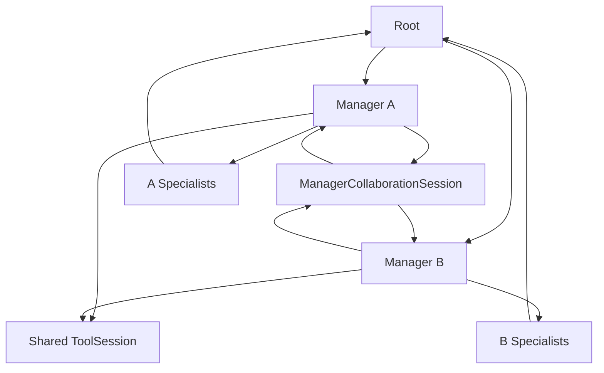

# Controlled Manager collaboration

AgentTree permits explicitly authorized Managers in the same `run()` to exchange task-relevant work products. Root still selects Managers, owns final review and synthesis, and supplies `FinalResult.final_output`. Specialists remain inside their owning Manager branch. Collaboration is a separate coordination runtime, **not a Tool** and not a Manager's direct call to another Manager's provider.



## Configure a directed relationship

After registering both Managers, call `tree.allow_manager_communication(backend, frontend)`. This grants Backend → Frontend requests. It does not grant Frontend → Backend requests; call the method again with reversed arguments if that direction is needed. The default is no allowed peers, so an existing Tree makes the same provider calls and emits the same phase events as before. Only Root-selected, registered Managers in the current execution may communicate. `tree.manager_permissions` exposes an ordered read-only assignment snapshot. `tree.last_collaboration_messages` returns an isolated bounded message snapshot from the last run.

Provider-backed Manager decomposition and review may return a strict JSON object instead of their normal decision:

```json
{"collaboration_request": {
  "target_manager_id": "registered-manager-id",
  "type": "request",
  "subject": "Authentication contract",
  "content": "Provide the login endpoint and response fields"
}}
```

Allowed request types are `request`, `context`, and `review_request`. The runtime creates `response` or `review_response` for request types. `context` delivers information to the peer's bounded inbox without a provider response. The requesting Manager's next provider turn receives `collaboration_result`, which contains success, safe error type if any, message/thread IDs, and the response work product. The Manager then emits the original decomposition or review JSON. `thread_id` may be supplied for a follow-up in an existing two-Manager thread; it must be a UUID. Parsing uses the same strict JSON decision parser as the rest of AgentTree.

`ManagerMessage` records execution, sender, recipient, type, subject, content, status, message ID, thread ID, and reply correlation. A peer response uses a new message ID, the request's thread ID, and `reply_to`/`correlation_id` equal to the request's message ID. Message types and statuses are enums. The receiver gets the request, a small amount of thread history, the original objective, its own instructions, provider/model binding, and only its own assigned Tools. It does not receive another Manager's private working context, credentials, raw provider objects, or hidden reasoning.

## Limits and failures

`AgentTreeConfig` defaults to four sent messages per Manager, twelve messages per execution, two request rounds per thread, 4,096 serialized bytes per payload, two collaboration requests per Manager decision, and a five-second peer wait. A successful request and response consume two messages. These limits are separate from Tool calls, provider transport behavior, and Manager revision counts. With defaults, at most six request/response pairs can be accepted in one execution. Each peer response uses the existing bounded ToolSession; at most four provider generations may occur in that turn under the default Tool round limit. Normal decomposition/review turns and revisions remain separately bounded by their own workflow rules.

Denied, invalid, oversized, timed-out, budget-exhausted, and failed peer requests return safe structured `collaboration_result.error_type` values so the requesting Manager can continue where its own task permits. A peer response turn is **non-reentrant**: it cannot request another Manager. This prevents synchronous A → B → A waiting cycles. Routing follows deterministic Manager phase order and request sequence; it does not introduce parallel Manager execution. A timed-out provider worker is marked cancelled and cannot deliver a late message or start a late Tool call through ToolSession. As with Phase 3's synchronous Tool timeout, an already-running external call cannot be forcibly stopped and may finish later in its daemon thread.

Trace events use `manager.collaboration.*` labels for requested, authorized, delivered, response.started, responded, denied, failed, timeout, budget_exhausted, and round_limit. They contain execution/Manager/message/thread IDs, type, status, and response duration, without full content or raw errors. `FinalResult.metadata["collaboration_metrics"]` reports message, thread, failure, and timeout counts separately from token usage and Tool metrics. Provider calls made for peer responses still contribute to provider token usage. Recovered collaboration failures remain visible in trace without forcing an otherwise successful Tree to fail.

Message content and metadata redact common credential patterns before storage, provider continuation, or inspection. The receiver treats peer content as data; its own Tool assignments and policy remain authoritative. A Manager cannot execute a peer's Tool remotely or control another Manager's Specialists. Applications should still avoid placing secrets in arbitrary task text or Manager messages. The legacy host-controlled `ToolExecutor` raw error behavior and late completion of synchronous Tool functions remain Phase 3 hardening work.

## Future Studio contract

The Tree editor can show a collaboration enable control and directed peer IDs for each Manager, along with message/round limits. Live View can consume the role-aware trace IDs, bounded message snapshots, and separate collaboration metrics to render request/response links. No Studio UI, database, queue service, streaming requirement, or persistent message store is part of this phase. A future long-running runtime may add durable scheduling and cancellation without changing the message distinction from Tools.
