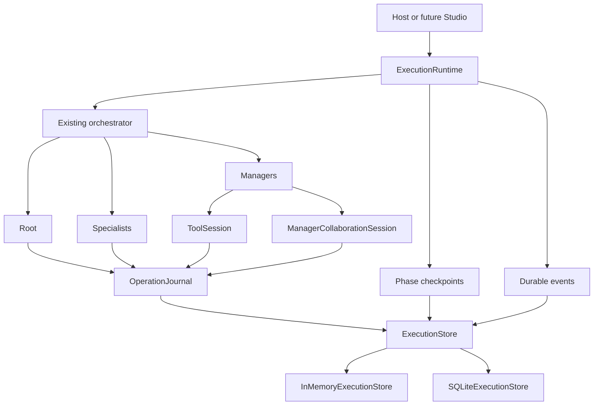

# Durable operation journal

`ExecutionRuntime` keeps the Phase 5 checkpoints and adds a journal for work inside each phase. The same orchestration runs under both sequential and LangGraph backends. A synchronous `AgentTree.run()` without a runtime behaves as before.

## Identity and durability

An operation key is stable within its execution and phase. Manager decomposition keys include the Manager ID; Specialist keys include Manager, Subtask, Specialist, and revision where applicable. Provider and collaboration turns use a position under their parent operation. Tool keys include the provider's call ID. The journal checks a SHA-256 digest of the normalized input before reusing a key. A mismatch raises `ExecutionRecoveryBlocked` with code `OPERATION_INPUT_MISMATCH`. This prevents a changed request from consuming a previous result.

`OperationRecord` stores a logical operation. `OperationAttempt` stores each physical start with an incrementing number. A process loss can leave attempt 1 uncertain while attempt 2 later commits the same logical provider request. The committed normalized result uses the Phase 5 allowlisted JSON codec. Durable intent is written before external work; a result is committed before the caller receives it. SQLite writes operation state, attempt, and matching event in one transaction. The in-memory store follows the same state rules. Neither store uses pickle.

States are `PREPARED`, `IN_FLIGHT`, `COMMITTED`, `FAILED`, `CANCELLED`, and `UNCERTAIN`. Valid transitions are checked centrally. A lost in-flight attempt becomes `UNCERTAIN`; that is not evidence of failure. The journal reuses a committed result, starts work from a prepared record, and applies the operation's policy to an uncertain attempt. Failed and cancelled operations do not silently restart.

Journaled work includes Root planning, direct response, final review and synthesis; Manager decomposition, review and collaboration; Specialist initial and revision execution; provider generation; and Tool calls. Parent keys link nested calls. A completed phase checkpoint still skips the entire phase. For an incomplete phase, orchestration reruns its pure coordination code and journal wrappers return committed results for already completed work. This preserves Subtask IDs, selected Specialist outcomes, Tool results, collaboration messages, usage accounting, and revision budgets without intentionally repeating committed external calls.

## Provider and Tool policy

Committed provider responses are reused. An uncertain provider call defaults to a new physical attempt on recovery. The earlier attempt remains marked uncertain; its possible billing and usage are unknown. AgentTree does not invent token counts for it. A provider may process two physical requests for one logical operation. Provider result reuse does not guarantee a repeatable model output if the first attempt was lost.

Tools declare `ToolRecoveryPolicy` in their constructor. Existing FunctionTool and MCPTool default to `UNKNOWN`; `NON_IDEMPOTENT` and `UNKNOWN` block automatic replay after an uncertain call. `PURE` allows replay. `IDEMPOTENT` allows replay with a stable key available inside Tool execution through `agenttree.core.current_operation_idempotency_key()`. The Tool implementation and external service must actually honor that key; AgentTree does not inject it into arbitrary Tool arguments. `RECONCILABLE` calls the optional `tool.reconcile(operation_record)` contract on recovery. It can return `ToolReconciliation(COMPLETED, ToolResult(...))`, `NOT_COMPLETED`, `UNKNOWN`, or `FAILED`. A confirmed completion commits the result without invoking the Tool again. A confirmed noncompletion permits a new attempt. Unknown blocks. A Tool subclass can override `reconcile`; the default returns unknown. Tool implementations should keep reconciliation read-only and bounded.

These are at-least-once or blocked recovery semantics, not an exactly-once guarantee for external systems. A committed Tool result is not intentionally replayed. A crash after the external side effect and before journal commit leaves an uncertain record. MCP methods can have arbitrary side effects and retain the conservative default.

## Events, inspection, and recovery

`handle.operations()` returns immutable operation snapshots. `handle.events(after=0, limit=100)` returns sequence envelopes; `after` is an exclusive cursor and `limit` is bounded to 1–1000. Sequences are per execution and continue after reopening SQLite. Operation state changes and their events commit together. Runtime lifecycle/checkpoint events are also appended. Events contain safe IDs, state, phase, attempt, and reason codes rather than prompts, credentials, Tool arguments, or raw provider output. The existing `FinalResult.trace` remains a separate compatibility view.

`runtime.recover(execution_id, reconstructed_tree)` still checks the Tree fingerprint and local process owner. It marks prior in-flight attempts uncertain. An unsafe Tool blocks with `ExecutionRecoveryBlocked.code == "UNCERTAIN_TOOL_OUTCOME"` and the relevant `operation_key`, while an `execution.recovery.blocked` event is recorded. The execution remains nonterminal for external reconciliation and a later recovery attempt. `result(timeout=...)` can time out while reconciliation is pending. Reconstruct the same Tree definitions and external bindings before recovery. Tool policy participates in the Tree fingerprint.

Cancellation and deadlines continue to use Phase 5 execution control. A late provider, Tool, or peer response cannot commit after cancellation wins, although a synchronous external call may finish physically. The journal does not create a distributed worker lease; recovery is local-process oriented. The SQLite file contains task data and potentially sensitive work products despite field/pattern redaction; restrict its filesystem access.

Future Studio routes can map `POST /api/v2/runs` to submission, `GET /api/v2/runs/{run_id}` to status, `POST /api/v2/runs/{run_id}/cancel` to cancellation, `GET /api/v2/runs/{run_id}/result` to the final result, and `GET /api/v2/runs/{run_id}/events?after=<sequence>` to the event cursor. Core provides no HTTP server, SSE, WebSocket, artifact store, or distributed queue.

## Architecture references

- [Temporal activity guidance](https://github.com/temporalio/documentation/blob/main/docs/develop/python/best-practices/error-handling.mdx): distinguish an activity's stable identity from physical attempts and make side effects idempotent where possible.
- [DBOS workflow tutorial](https://docs.dbos.dev/python/tutorials/workflow-tutorial): reuse recorded step results after restart.
- [OpenTelemetry event conventions](https://opentelemetry.io/docs/specs/semconv/general/events/): record named, point-in-time outcomes in an ordered event stream.
- [Stripe idempotent requests](https://docs.stripe.com/api/idempotent_requests): couple an idempotency identity with parameter comparison. AgentTree uses an input digest but does not assume every Tool's destination supports Stripe-like guarantees.
