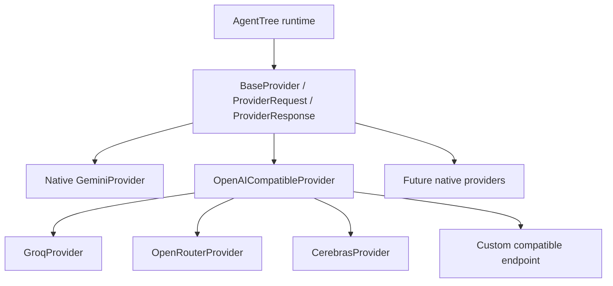

# ผู้ให้บริการโมเดล

ขอบเขตของ provider ทำงานแบบซิงโครนัสและไม่ผูกกับผู้ให้บริการรายใด:

```python
response = provider.generate(ProviderRequest(prompt="Summarize this input"))
```

`ProviderRequest` บรรจุ prompt, system prompt ที่เป็นตัวเลือก, context แบบมีโครงสร้าง, metadata, โมเดล, temperature และขีดจำกัด token ส่วน `ProviderResponse` ทำ normalization ให้เนื้อหา ตัวตน provider/โมเดล usage ที่เป็นตัวเลือก metadata และข้อมูลดิบฉบับคัดลอกที่เป็นตัวเลือก `ProviderConfig` ตั้งใจไม่รวมข้อมูลรับรอง เพราะอาจถูกนำไปใช้ในการวินิจฉัย

## การพัฒนาแบบออฟไลน์

`MockProvider` บันทึก request และส่งคืน response ที่ให้ผลแน่นอนโดยไม่เรียก SDK หรือเครือข่าย:

```python
from agenttree.providers import MockProvider, ProviderConfig

provider = MockProvider(
    ProviderConfig(provider_name="offline-worker", model="offline-fixture"),
    response_content="Fixed output",
)
```

## การตัดสินใจกำหนดเส้นทางด้วย provider

`ProviderTaskTriage(provider)` และ `ProviderTaskDecomposer(provider)` ยังคงเป็นรูปแบบ constructor ที่ใช้งานได้ ในลำดับงานระดับสูง ระบบประสานงานจะใส่ตัวเลือกการกำหนดเส้นทางปัจจุบันใน request ของ provider แต่ละรายการโดยอัตโนมัติ:

- การคัดแยกได้รับความสามารถแบบ normalized จาก Manager ที่ลงทะเบียน
- การแยกงานได้รับความสามารถแบบ normalized จาก Specialist ที่ลงทะเบียนและอยู่ภายใต้ Manager ที่เลือก

system prompt และ context แบบมีโครงสร้างของ request จะแสดงตัวเลือกเหล่านี้อย่างตรงตัว ค่าความสามารถที่ส่งกลับมาจะถูกตัดช่องว่าง, casefold, ตัดรายการซ้ำ และจับคู่กับค่ามาตรฐานที่มีอยู่ ค่าที่ไม่รู้จักจะทำให้ยก `DecisionOutputError` และจะไม่ถูกส่งไปค้นหาใน registry ผู้เรียกใช้งานโดยตรงขั้นสูงสามารถส่ง `available_capabilities=` อย่างชัดเจนได้ หากละไว้จะยังคงพฤติกรรมการเรียกโดยตรงแบบไม่จำกัดเดิมเพื่อความเข้ากันได้

## อะแดปเตอร์เสริม

ติดตั้งอะแดปเตอร์หนึ่งรายการหรือทั้งสามรายการ:

```sh
python -m pip install "agenttree[openai]"
python -m pip install "agenttree[gemini]"
python -m pip install "agenttree[ollama]"
python -m pip install "agenttree[providers]"
```

`OpenAIProvider`, `GeminiProvider` และ `OllamaProvider` รับ `ProviderConfig` ที่ไม่มีข้อมูลลับ และอาจรับ SDK client ที่ inject เข้ามา ไม่มีชื่อโมเดลใดถูกกำหนดตายตัว ให้เลือกโมเดลในการกำหนดค่าของแอปพลิเคชัน ปล่อยให้ SDK ที่เกี่ยวข้องอ่าน environment เช่น `OPENAI_API_KEY`, `GOOGLE_API_KEY` หรือ `OLLAMA_HOST` หรือสร้างและ inject client ที่กำหนดค่าแล้ว ห้ามใส่ข้อมูลลับใน `ProviderConfig.metadata`, metadata ของ Task, ผลลัพธ์ หรือ trace

อะแดปเตอร์ทำ normalization ให้ response และการใช้ token ของ SDK โดยไม่เปิดเผยคลาส SDK แก่ระบบประสานงาน

## Provider architecture



The existing `generate(request)` method remains the provider contract used by
the runtime. `list_models(refresh=False)` and `validate_connection()` are
optional discovery and validation operations. `ProviderCapabilities` reports
known provider support; `None` means unknown or model dependent. Discovery
returns `ProviderModel` records with exact model IDs and optional context,
pricing, modality, and parameter metadata. No model catalog is hardcoded.
Discovery is cached per provider instance for five minutes by default;
`refresh=True` bypasses the cache. Failed discovery is never cached.

The shared compatible adapter uses `/chat/completions` and `/models`. It has a
15 second request timeout by default, no automatic retries, default TLS
verification, and blocked redirects. It allows HTTP only for loopback custom
servers. Authentication headers cannot be overridden through custom headers or
per-request `provider_options`. Optional parameters must be on a provider's
allowlist. Provider errors are classified without copying SDK or HTTP error
messages into results. A rate-limit error can carry a bounded `retry_after`
value, but the runtime does not automatically sleep or retry. Manager quality
revisions remain separate from transport failures.
The fixed endpoints follow the providers' current documentation:
[Groq](https://console.groq.com/docs/openai),
[OpenRouter](https://openrouter.ai/docs/quickstart), and
[Cerebras](https://inference-docs.cerebras.ai/api-reference/chat-completions).

```python
import os
from agenttree.providers import (
    CerebrasProvider, GroqProvider, OpenRouterProvider,
    OpenAICompatibleProvider, ProviderConfig,
)

groq = GroqProvider(ProviderConfig("groq"), api_key=os.environ["GROQ_API_KEY"])
router = OpenRouterProvider(
    ProviderConfig("openrouter"), api_key=os.environ["OPENROUTER_API_KEY"],
    headers={"HTTP-Referer": "https://example.invalid"},  # optional attribution
)
cerebras = CerebrasProvider(
    ProviderConfig("cerebras"), api_key=os.environ["CEREBRAS_API_KEY"],
)
local = OpenAICompatibleProvider(
    ProviderConfig("local", model="your-model"),
    base_url="http://127.0.0.1:8000/v1", model_discovery=True,
)

models = groq.list_models()
connection = groq.validate_connection()
```

Native Gemini support remains separate from the compatible HTTP adapter.
Gemini model discovery uses its SDK and requires the `gemini` extra. The
compatible providers and custom endpoint use the Python standard library.
Existing OpenAI and Ollama adapters remain available.
Gemini configures a 15 second SDK request timeout by default; injected SDK
clients retain their own timeout policy. The existing OpenAI and Ollama SDK
adapters do not accept the new per-request timeout or provider options.

## Per-agent routing

Register each provider, then call `tree.bind_provider(agent, provider,
model="exact/discovered-model-id")` for the Root, Managers, and Specialists.
The Root binding automatically supplies provider-backed Root planning and
final synthesis when those strategies were not explicitly supplied. Provider
backed triage and final review use the Root binding. Provider backed
decomposition and Manager review use that Manager's binding. Static strategies
remain static. Each Specialist's execution resolves its own binding and model.
The previous Specialist binding API remains valid.

For later Studio integration, supply provider instances and exact model IDs,
register them with the Tree, bind each configured agent, and construct
provider-backed Manager decision strategies where model reasoning is wanted.
Studio does not need to pass provider-specific data into orchestration.
`final_output` remains the displayed answer; `orchestration` remains
diagnostic data.

## Optional live tests

The [Phase 7.5 Groq live gate audit](phase-7-5-live-provider-gate.md)
distinguishes offline adapter coverage from authentication and behavior
observed against the real service. A live smoke must select an account-visible
discovered model; documentation alone does not prove availability or Tool
behavior for that account.

Set `GEMINI_API_KEY`, `GROQ_API_KEY`, `OPENROUTER_API_KEY`, and/or
`CEREBRAS_API_KEY` in the environment and run
`python -m pytest tests/test_live_providers.py`. Each individual test skips
without its key. The mixed Tree test skips unless all four keys and the Gemini
SDK are available. Discovery chooses a model only when metadata identifies a
text chat model; a discovered model ID can be supplied explicitly through
`GEMINI_TEST_MODEL`, `GROQ_TEST_MODEL`, `OPENROUTER_TEST_MODEL`, or
`CEREBRAS_TEST_MODEL` when discovery metadata is insufficient. Keys are never
printed by these tests.
